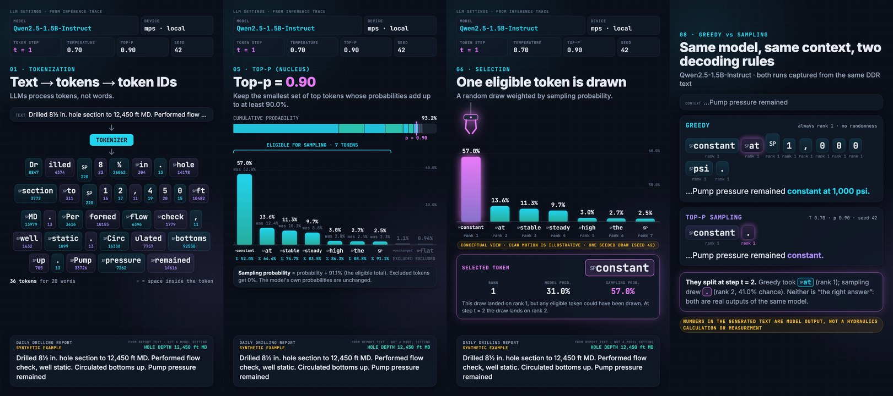
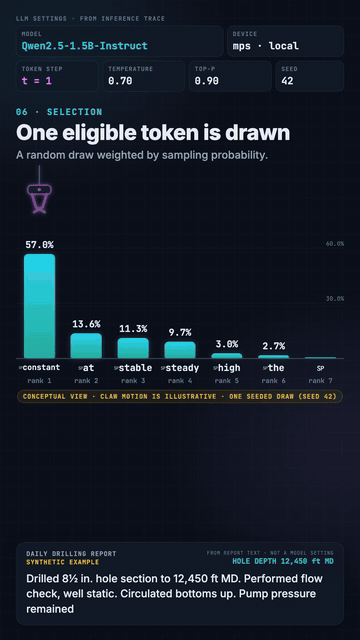

# How an AI Language Model Writes the Next Word of a Daily Drilling Report (DDR)

**When an AI model like ChatGPT writes the next part of a drilling report, how does it decide what comes next?**

This project answers that with a real experiment on a laptop, not an illustration. We give a language model the start of a Daily Drilling Report entry, record exactly what it calculates at each step, and turn that recording into a short vertical video for phones and LinkedIn.

**▶ [Watch the video](https://github.com/djimrastephane/llm-next-token-ddr/releases/latest)** (56 seconds, vertical format; open the `.mp4` under *Assets*). No installation is needed to watch it. While this repository is private, you need access to it to open the link.

> **Every word choice, probability, ranking and selection in the video was recorded from a real AI model running on a laptop. None of it was written by hand for the animation.**

---

## Summary for drilling engineers

No programming knowledge is needed for this section.

**The problem.** General-purpose AI language models write text that *sounds* like an experienced driller wrote it. But they produce each word by predicting what usually comes next in text they have seen. They do not calculate pressures, mud weights or volumes, and they know nothing about your well beyond the words you give them.

**What the video shows.** A small open model (Qwen2.5-1.5B) running locally on a laptop continues this synthetic report entry:

> *Drilled 8½ in. hole section to 12,450 ft MD. Performed flow check, well static. Circulated bottoms up. Pump pressure remained…*

You watch it break the text into pieces, score every possible next piece, narrow the choice down, and pick one, one word-piece at a time.

**What we found.** The same model, given the same sentence, wrote different reports depending on a single setting:

| Setting | The model wrote |
|---|---|
| Always take the most likely word ("greedy") | …Pump pressure remained **constant at 1,000 psi.** |
| Pick at random among the likely words ("sampling", as chat assistants typically do) | …Pump pressure remained **constant.** |
| Same sampling, earlier wording of the report ([v0.2.1](https://github.com/djimrastephane/llm-next-token-ddr/releases/tag/v0.2.1)) | …Pump pressure remained **constant at 3,800 psi.** |

None of these pressures came from a calculation. The report says nothing about flow rate, mud weight, mud properties or drill-string geometry, so the model had no basis for any number. It wrote a figure because figures commonly follow "pump pressure remained constant at" in text.

**The takeaway.** A believable number in a generated report is not evidence of anything. DDRs feed well histories, offset-well planning, incident investigations and regulatory reporting, so an invented pressure that reads correctly can mislead long after the shift. If AI models help draft DDR narratives, the wording can be drafted, but **every value must come from the rig's measured data and engineering calculations and be checked by the person who signs the report**.

---

## What you'll see in the video

1. **The question:** the report text, and "What comes next?"
2. **Tokenization:** the text is split into 36 pieces called *tokens*, each with its ID number
3. **Forward pass:** the model gives a score to every entry in its vocabulary (151,936 slots)
4. **Probabilities:** the scores become percentages
5. **Temperature:** a setting (0.70) that makes likely tokens more likely
6. **Top-p:** only the most likely tokens, covering 90% of the probability, stay in the running
7. **Selection:** one token is drawn at random, weighted by its chance (the claw is illustrative)
8. **The loop:** the chosen token is added to the report, and the process repeats
9. **Greedy vs sampling:** the same model and report, two selection rules, two different continuations
10. **The code:** the whole loop as seven lines of simplified pseudocode
11. **Summary:** LLMs generate text one token at a time

The video labels its simplified parts. The "LOCAL LLM" box and the claw are marked *CONCEPTUAL VIEW*: they are not pictures of what happens inside the model. The code card is marked *SIMPLIFIED*.

---

## The ideas, in plain language

**Token.** LLMs don't read words. They read *tokens*: chunks of text from a fixed dictionary. A token can be a whole word (` pressure`), part of a word (`Dr` + `illed`), a single digit (`1`, `2`, `4`, `5`, `0`), punctuation (`,`), a space, or a special control marker. In our DDR text, 20 words became **36 tokens**. Many tokens begin with a space; the video shows that space as `␠` (e.g. `␠pressure`) so it isn't hidden.

**Tokenizer.** The tool that splits text into tokens. It is fixed and deterministic, and it belongs to the model.

**Token ID.** Each token's number in the model's dictionary. ` pressure` is 7262. The model only ever sees these numbers.

**Logit (score).** For the next position, the model produces one raw score for **every** entry in its vocabulary. For Qwen2.5 that is 151,936 scores: 151,665 real tokens plus 271 unused padding slots, whose total probability is below 0.00002%. A higher score means the model considers that token more fitting. Scores aren't probabilities: they can be any number.

**Softmax → probability.** Softmax turns the scores into probabilities between 0 and 100% that add up to 100%. **Softmax does not choose anything**; it only converts.

**Temperature.** A dial applied before softmax. Below 1 (we use 0.70), likely tokens become even more likely (the distribution *sharpens*). Above 1, it flattens. Temperature adds **no randomness by itself**; it only reshapes the probabilities used by the next steps. In our run, ` constant` went from 31.0% (the model's own distribution) to 52.0% at T = 0.70.

**Top-p (nucleus).** Rank the tokens from most to least likely and keep adding them until their probabilities add up to at least *p* (we use 90%). Only these tokens are *eligible*; everything else is *excluded*. The eligible probabilities are then rescaled to add up to 100% again. That's why the video shows two different numbers:

- **model probability**: the model's own distribution (temperature 1);
- **sampling probability**: after temperature, top-p filtering, and rescaling. This is what the random draw actually uses.

**Greedy decoding.** Always take the #1 token. Deterministic, with no randomness, no temperature, and no top-p.

**Stochastic sampling.** Draw one eligible token at random, weighted by sampling probability. The top token is the most likely pick but **not guaranteed**. We fix the random seed so the run is repeatable.

**Autoregressive generation.** The selected token is appended to the text, and the whole process repeats for the next token. Text grows one token at a time.

---

## Where the numbers come from

| | |
|---|---|
| **Model** | `Qwen/Qwen2.5-1.5B-Instruct` (revision `989aa798…`), full precision (float32) |
| **Computer** | Apple M4 Pro laptop (`mps`), local, no cloud service |
| **Report text** (synthetic) | *Drilled 8½ in. hole section to 12,450 ft MD. Performed flow check, well static. Circulated bottoms up. Pump pressure remained* |
| **Prompt** | the report text only, with no hidden instructions |
| **Selection rule** | top-p sampling: temperature 0.70, top-p 0.90, random seed 42 |
| **Length** | until the model ends the sentence (maximum 40 tokens): 2 tokens |
| **Result (sampling)** | `… Pump pressure remained` **` constant.`** |
| **Result (greedy, same text)** | `… Pump pressure remained` **` constant at 1,000 psi.`** |

At step 2 the draw picked the **second-ranked** token `.` (41.0% chance) over ` at` (43.7%), ending the sentence where greedy decoding continues with "at 1,000 psi.". The video keeps that result as recorded. The stopping rule (stop when the model ends the sentence) was fixed before looking at any output. The full record is in [`data/generated/inference_trace.json`](data/generated/inference_trace.json).

### About the report examples

The four examples in [`data/input/ddr_contexts.json`](data/input/ddr_contexts.json) (drilling, completions, well intervention, well integrity) are **synthetic: written for this project, not taken from any operator**. Real DDRs usually belong to the operator and are confidential. Synthetic text avoids exposing any real well, and lets us check that each example is operationally sound. The examples were written before any model output was seen, and none has been edited to steer the model.

The drilling example was reworded once, for operational correctness. A flow check is done with the pumps off, so the original wording ("…Circulated bottoms up and performed flow check. Pump pressure remained") put a pump-pressure observation after it. The flow check now comes first. The new wording was fixed before re-running the model, and the earlier run is kept in release [v0.2.1](https://github.com/djimrastephane/llm-next-token-ddr/releases/tag/v0.2.1).

---

## Limitations

- A 1.5-billion-parameter general-purpose model has no drilling training guarantees. Its continuations are plausible text, not engineering judgement.
- The model only sees the words of the report. It has no access to rig sensors, mud reports or well plans.
- A run is repeatable on the same computer and software, but another computer can produce slightly different numbers and occasionally a different word.
- The loop scene plays the later steps faster, to keep the video under a minute.

---

## For developers

Installation, capturing new traces, rendering, the exact formulas, the trace format and the test suite are in **[DEVELOPMENT.md](DEVELOPMENT.md)**.

## Licence

Code and documentation: [MIT](LICENSE). The model, Qwen2.5-1.5B-Instruct, is released by the Qwen team under Apache 2.0 and is downloaded separately, not redistributed here.
